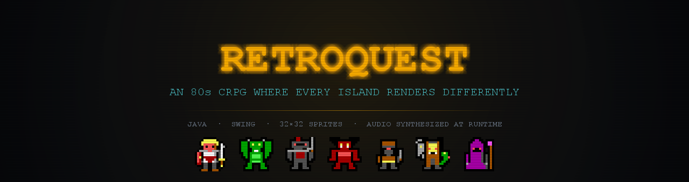
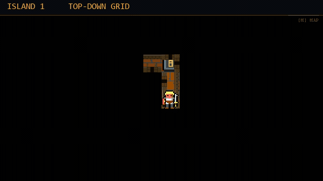

<div align="center">




</div>

An 80s-style tile-based fantasy CRPG for the desktop, written in Java/Swing — and the RetroForge
editor you build it with.

You wash ashore on Lirandel with nothing, and work your way across seven islands
(Lirandel → Pyralis → Zephyrion → Sylvandar → Thalorax → Umbryn → Bellorak), each sealed behind a
key earned on the island before it. Along the way: towns, shops, inns, branching NPC dialogue,
quests, casinos and island mini-games, turn-based combat with a 37-spell book, and dungeons that
change how they look as you go.

All artwork is 32×32 sprites and all audio is synthesized at runtime — there are no sound files.

## The dungeons change how they are drawn

This is the part worth watching. The renderer escalates with the island ladder — same game, same
engine, a different way of drawing a corridor on each rung:

<div align="center">



</div>

| Islands | Renderer | What you get |
|---|---|---|
| 1 | `TOP_DOWN` | Overhead grid, torch-lit, one square at a time |
| 2–3 | `WIREFRAME` | First-person vector line work, four directions |
| 4–5 | `TEXTURED` | Five masonry styles laid out in **world depth**, so courses foreshorten the way real stone does |
| 6–7 | `RAYCAST` | One ray per screen column — any angle, per-pixel lighting, and real cast shadows precomputed per level |

On islands 6–7 the map carries its own lights: any tile with a `lightRadius` in the tile registry
*is* a light, which means lighting is authorable in the editor rather than baked into the renderer.

## Running

Requires a JDK on PATH (this checkout is built with Amazon Corretto 26; the pom targets Java 17 bytecode).

```bash
# Windows
run-retroquest.bat        # the game
run-retroforge.bat        # the RetroForge editor
```

Or directly, **from the repository root** (all `data/` and `saves/` paths are resolved relative to
the working directory):

```bash
export JAVA_HOME="C:/Program Files/Amazon Corretto/jdk26.0.0_35"
mvn compile
java -cp "target/classes;$(< cp.txt)" io.cannonforge.retroquest.core.Retroquest
```

Saves live in `saves/`; game content (maps, tiles, items, monsters, quests) lives in `data/` and is
editable in RetroForge.

## Building installers

### Windows

```bash
export JAVA_HOME="C:/Program Files/Amazon Corretto/jdk26.0.0_35"
mvn -Pdist clean package verify
```

The **`-Pdist` profile is required.** jlink needs a full JDK with `jmods/` and Launch4j only emits a
Windows executable, so those stages are opt-in — without the profile the build still succeeds, it
just stops after the fat JAR and silently produces no installer.

This produces `target/RetroQuest-1.1.0-windows.zip` containing:
- `RetroQuest-Setup.exe` — native installer (no Java required)
- `jre/` — bundled Java runtime

Distribute the zip, or `RetroQuest-Setup.exe` on its own — it already carries the runtime inside it.

> The installer is unsigned, so Windows SmartScreen will warn on first run. Choose
> **More info → Run anyway**.

## Regenerating the artwork in this README

```bash
javac -encoding UTF-8 -d tools tools/BannerGen.java && java -cp tools BannerGen docs/media
```

The renderer-ladder GIF is cut from clips the game films of itself offscreen — see
`docs/video/06-RECORDER.md` and `tools/record.sh`.

## Documentation

`docs/Architecture.md` is the starting point and links to every subsystem document.

## Known issues

### Desktop icons missing when OneDrive is enabled (Windows)

If your Desktop folder is managed by OneDrive (via "Known Folder Move" / Desktop backup), shortcut
icons and file icons may appear blank or as generic white squares. This is caused by OneDrive's
file-on-demand placeholders preventing Windows from reading the icon files.

**Fix:** Open OneDrive Settings → Sync and backup → Manage backup → toggle **Desktop** off. Icons
should reappear once files are stored locally again.

## Licence

Apache 2.0 — see [LICENSE](LICENSE) and [NOTICE](NOTICE).
